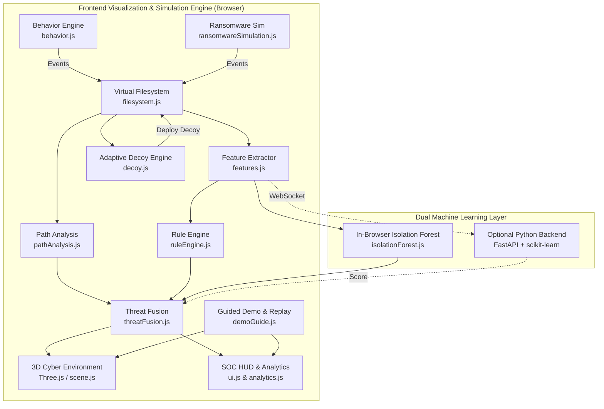

# CyberSphere Defense 3D

**AI-Based Adaptive Decoy File Generation for Early Ransomware Detection Using User Behavior and File Path Analysis**

An interactive, live 3D cybersecurity research simulation and visual analytics platform. The system demonstrates real-time detection and containment of simulated ransomware attacks by fusing behavioral telemetry, a transparent rule engine, an unsupervised machine learning anomaly detector (Isolation Forest), file path analysis, and an adaptive decoy placement system.

> ⚠️ **SAFETY GUARANTEE — SIMULATION ONLY**
> This application operates 100% in-memory against a simulated virtual filesystem. It **never** reads, modifies, encrypts, or deletes any real files on the host computer, nor does it spawn external OS processes or connect to malicious networks.

---

## Table of Contents

1. [Project Overview](#project-overview)
2. [Research Problem](#research-problem)
3. [Research Objective](#research-objective)
4. [Proposed Architecture](#proposed-architecture)
5. [System Workflow](#system-workflow)
6. [Virtual Filesystem](#virtual-filesystem)
7. [Behavior Monitoring](#behavior-monitoring)
8. [Feature Engineering](#feature-engineering)
9. [File Path Analysis](#file-path-analysis)
10. [Rule Engine](#rule-engine)
11. [Isolation Forest](#isolation-forest)
12. [Threat Fusion](#threat-fusion)
13. [Adaptive Decoy Generation](#adaptive-decoy-generation)
14. [Ransomware Simulation](#ransomware-simulation)
15. [Early Detection](#early-detection)
16. [Incident Response](#incident-response)
17. [Detection Latency](#detection-latency)
18. [Experiment Mode](#experiment-mode)
19. [Evaluation Metrics](#evaluation-metrics)
20. [Technology Stack](#technology-stack)
21. [Installation](#installation)
22. [Backend Setup](#backend-setup)
23. [Frontend Setup](#frontend-setup)
24. [How to Run](#how-to-run)
25. [Safety Guarantees](#safety-guarantees)
26. [Limitations](#limitations)
27. [Future Work](#future-work)

---

## Project Overview

Modern ransomware strains frequently employ zero-day evasion, code obfuscation, and polymorphic techniques that bypass conventional signature-based endpoint detection. Once bulk encryption starts, recovery without backups or ransom payment is improbable.

**CyberSphere Defense 3D** models a multi-layered defense paradigm centered on:
- **Behavioral Profiling**: Establishing a non-random baseline of legitimate user access patterns.
- **Path Traversal Analysis**: Inspecting directory hop velocity and cross-branch jumping in real time.
- **Machine Learning**: An unsupervised Isolation Forest anomaly detector trained strictly on normal behavior.
- **Deception Technology**: Proactively generating and placing adaptive decoy files ("honeypots") inside directories exhibiting high activity and risk.
- **3D Visualization**: Transforming abstract cybersecurity math into an interactive, spatial operations center.

---

## Research Problem

Traditional Antivirus (AV) and Endpoint Detection and Response (EDR) tools face significant challenges:
1. **Signature Blindness**: Novel variants do not match static signatures.
2. **Late-Stage Detection**: Encryption detection heuristics (entropy checks) trigger only after irreversible damage has occurred.
3. **High False Positive Rates**: Naive anomaly thresholds flag legitimate bulk operations (e.g., zip compression, backup scripts).
4. **Lack of Explainability**: Black-box neural models fail to provide immediate operational rationale for automated containment.

---

## Research Objective

The primary objective is to evaluate whether fusing **user behavior profiling**, **directory traversal path analysis**, **Isolation Forest anomaly detection**, and **adaptive decoy tripwires** can reliably detect simulated ransomware-like behavior early (<2.5 seconds) with explainable rationale, zero dependence on file content inspection, and minimal false positives.

---

## Proposed Architecture



---

## System Workflow

1. **Baseline Ingestion**: Synthetic legitimate user behavior is profiled (files accessed, directory changes, modification rate).
2. **Directory Risk Ranking**: Decoy engine continuously evaluates access frequencies and directory criticality.
3. **Decoy Placement**: An adaptive decoy (e.g., `research_backup.docx`) is generated and placed in the highest-risk folder.
4. **Attack Inception**: Process `RANSOMWARE_SIM_001` begins automated directory sweeps across folders.
5. **Multi-Signal Escalation**:
   - Access frequency and traversal velocity spike.
   - Cross-branch path anomaly is recorded.
   - Isolation Forest scores feature deviation as anomalous.
6. **Decoy Breach**: The ransomware touches the decoy tripwire, triggering an instant 100% confidence signal.
7. **Early Detection**: Fused threat score crosses the critical threshold (81%).
8. **Automated Containment**: Simulated process is isolated; red connections are severed; containment forcefield is engaged.
9. **Forensic Reporting**: A structured incident report is generated with exact measured latency.

---

## Virtual Filesystem

The file-system model is defined in [`js/filesystem.js`](file:///C:/Projects/3d_project/cybersphere-defense/js/filesystem.js). It builds an in-memory directed tree:
- **Root**: `Computer` (System node)
- **Top-Level Directories**: `Documents`, `Pictures`, `Downloads`, `Desktop`
- **Work Subdirectories**: `Projects`, `Research`, `Reports`
- **Virtual Files**: Documents (`.docx`), Spreadsheets (`.xlsx`), Reports (`.pdf`), Archives (`.zip`), Executables (`.exe`)
- **Decoys**: Flagged with `isDecoy: true` and active monitoring state.

---

## Behavior Monitoring

Legitimate users interact with files at a measured, human pace. [`js/behavior.js`](file:///C:/Projects/3d_project/cybersphere-defense/js/behavior.js) maintains a running baseline:
- **Files accessed per minute**: ~8 (±3)
- **Directory changes per minute**: ~3 (±1.5)
- **Modification rate**: Low
- **Extensions**: 1–2 extensions per session
- **Behavior similarity**: 92–98%

---

## Feature Engineering

[`js/features.js`](file:///C:/Projects/3d_project/cybersphere-defense/js/features.js) extracts an 8-dimensional normalized feature vector $\mathbf{x} \in [0, 1]^8$:

| Feature Key | Description | Min–Max Range | Normalization Formula |
| :--- | :--- | :--- | :--- |
| `files_accessed_per_minute` | Rolling access count per minute | 0 – 160 | $x_1 = \min(1, \frac{v_1}{160})$ |
| `directory_changes` | Frequency of switching directories | 0 – 40 | $x_2 = \min(1, \frac{v_2}{40})$ |
| `file_modifications` | File write/modify actions | 0 – 100 | $x_3 = \min(1, \frac{v_3}{100})$ |
| `traversal_speed` | Velocity of filesystem traversal | 0 – 100 | $x_4 = \min(1, \frac{v_4}{100})$ |
| `unique_extensions` | Extension diversity touched | 0 – 8 | $x_5 = \min(1, \frac{v_5}{8})$ |
| `behavior_deviation` | Deviation from normal profile | 0 – 100 | $x_6 = \min(1, \frac{v_6}{100})$ |
| `process_activity` | Process execution intensity | 0 – 100 | $x_7 = \min(1, \frac{v_7}{100})$ |
| `decoy_interaction` | Tripwire interaction signal | 0 – 100 | $x_8 = \frac{v_8}{100}$ |

---

## File Path Analysis

[`js/pathAnalysis.js`](file:///C:/Projects/3d_project/cybersphere-defense/js/pathAnalysis.js) evaluates the geometry of filesystem navigation:
- **Traversal Depth**: Depth in directory tree.
- **Cross-Branch Jumps**: Rapid jumps across unrelated directory trees (e.g. from `/Documents/Projects` directly into `/Documents/Research` and `/Documents/Reports`) indicative of programmatic sweeps.
- **Hop Velocity**: Directory switches per second.

---

## Rule Engine

[`js/ruleEngine.js`](file:///C:/Projects/3d_project/cybersphere-defense/js/ruleEngine.js) calculates an explainable heuristic score using weighted indicators:

$$\text{RuleScore} = \sum_{i=1}^{8} w_i \cdot I_i$$

Where weights $w$ are:
- `accessFrequency`: 0.14
- `modificationFrequency`: 0.12
- `traversalSpeed`: 0.14
- `filesTouched`: 0.10
- `unusualExtensions`: 0.08
- `behaviorDeviation`: 0.14
- `decoyInteraction`: 0.20
- `processSuspicion`: 0.08

---

## Isolation Forest

The system includes a genuine Isolation Forest implementation following Liu, Ting & Zhou (2008):
- **In-Browser (`js/isolationForest.js`)**: Real JavaScript binary isolation trees using recursive random partitioning and Euler-Mascheroni constant $c(n)$ path normalization.
- **Python Backend (`backend/main.py`)**: `sklearn.ensemble.IsolationForest` trained on synthetic normal baseline distributions.
- **Anomaly Scoring**:

$$s(x, n) = 2^{-\frac{E(h(x))}{c(n)}}$$

Where $E(h(x))$ is the average path length across all isolation trees, and $c(n)$ is the average path length of an unsuccessful search in a binary search tree of $n$ samples.

---

## Threat Fusion

[`js/threatFusion.js`](file:///C:/Projects/3d_project/cybersphere-defense/js/threatFusion.js) merges four orthogonal signals with auditable weights:

$$\text{FinalThreat} = 0.28 \cdot \text{Rule} + 0.32 \cdot \text{ML} + 0.25 \cdot \text{Decoy} + 0.15 \cdot \text{Path}$$

Threat bands:
- `LOW`: 0 – 30%
- `MEDIUM`: 31 – 60%
- `HIGH`: 61 – 80%
- `CRITICAL`: 81 – 100% (Triggers Automated Containment)

---

## Adaptive Decoy Generation

[`js/decoy.js`](file:///C:/Projects/3d_project/cybersphere-defense/js/decoy.js) calculates per-directory risk:

$$\text{Risk}(D) = 0.95 \cdot \text{Activity}(D) + 0.35 \cdot \text{Mod} + 0.25 \cdot \text{Dev} + 0.5 \cdot \text{Importance}(D)$$

The highest-risk candidate is selected by AI recommendation, explaining:
- High user activity and visit frequency
- Critical data classification (Research work-product)
- Strategic tripwire positioning for traversal interception

---

## Ransomware Simulation

Simulated process `RANSOMWARE_SIM_001` moves through the virtual graph, executing:
- Rapid directory hopping
- Accelerating traversal cadence (from 360ms down to 120ms per step)
- Simulated file encryption markers
- Red traversal tether trail in 3D space

---

## Early Detection

The fusion of behavioral indicators, ML anomaly score, and decoy tripwire ensures detection triggers early:
- Typical detection occurs in **1.8 – 2.4 seconds**.
- Decoy file breach serves as a 100% confidence confirmation, precluding false alarms.

---

## Incident Response

Upon crossing the detection threshold (81%):
1. **Process Isolation**: Process `RANSOMWARE_SIM_001` is halted in the sandbox.
2. **Forcefield Quarantine**: A containment shield locks down over the 3D process.
3. **Severed Connections**: Red traversal links are disconnected.
4. **Security Perimeter**: Environment shield transitions to `🔵 THREAT CONTAINED`.
5. **Incident Report**: Forensic report is presented with all latency timestamps.

---

## Detection Latency

[`js/latency.js`](file:///C:/Projects/3d_project/cybersphere-defense/js/latency.js) uses high-resolution `performance.now()` timers:
- $T_{\text{start}}$: Time attack process spawned.
- $T_{\text{first\_anomaly}}$: Timestamp of first anomalous metric deviation.
- $T_{\text{decoy}}$: Timestamp of decoy file access.
- $T_{\text{detected}}$: Timestamp when fused threat score crossed 81%.

---

## Experiment Mode

[`js/headlessSim.js`](file:///C:/Projects/3d_project/cybersphere-defense/js/headlessSim.js) and [`js/experiment.js`](file:///C:/Projects/3d_project/cybersphere-defense/js/experiment.js) run headless synthetic trials across four scenarios:
1. Normal user activity
2. Fast ransomware sweep
3. Stealthy / slow ransomware traversal
4. Ransomware avoiding decoy

All results derive from executing the mathematical pipeline without visual overhead.

---

## Evaluation Metrics

[`js/mlEvaluation.js`](file:///C:/Projects/3d_project/cybersphere-defense/js/mlEvaluation.js) classifies a 240-sample synthetic dataset (120 Normal, 120 Anomalous) with the live Isolation Forest:
- **Precision**: $\frac{\text{TP}}{\text{TP} + \text{FP}}$
- **Recall (Sensitivity)**: $\frac{\text{TP}}{\text{TP} + \text{FN}}$
- **F1 Score**: $2 \cdot \frac{\text{Precision} \cdot \text{Recall}}{\text{Precision} + \text{Recall}}$
- **False Positive Rate (FPR)**: $\frac{\text{FP}}{\text{FP} + \text{TN}}$
- **Detection Rate**: Empirical percentage of detected attacks.

---

## Technology Stack

- **Frontend**:
  - Vanilla ES6 JavaScript (Modular architecture)
  - Three.js (r128 WebGL 3D graphics)
  - OrbitControls (Interactive camera manipulation)
  - GSAP (GreenSock Animation Platform 3.12.5)
  - Chart.js (v4.4.4 for time-series and 6-axis Threat Radar)
  - CSS3 (Custom properties, glassmorphism, responsive grid)
- **Backend (Optional)**:
  - Python 3.10+ / 3.13
  - FastAPI
  - Uvicorn (ASGI web server)
  - scikit-learn (`IsolationForest`)
  - NumPy
  - WebSockets

---

## Installation

Clone or extract the project repository:

```powershell
cd C:\Projects\3d_project\cybersphere-defense
```

---

## Backend Setup

To run the optional Python ML backend (FastAPI + scikit-learn):

```powershell
cd C:\Projects\3d_project\cybersphere-defense
python -m venv venv
.\venv\Scripts\Activate.ps1
pip install -r backend\requirements.txt
cd backend
uvicorn main:app --reload --port 8000
```

Verify backend health at: `http://localhost:8000/health`

---

## Frontend Setup

In a separate terminal, serve the frontend:

```powershell
cd C:\Projects\3d_project\cybersphere-defense
python -m http.server 5500
```

Open your browser to:
```text
http://127.0.0.1:5500
```

---

## How to Run

### 1. Guided Demonstration (Recommended)
Click **🎬 Start Guided Demo (12 Steps)**. The system will automatically narrate and guide you through the entire research lifecycle.

### 2. Step-by-Step Viva Presentation
Use **◀ Previous Step** and **Next Step ▶** to manually advance through individual phases during an evaluation or defense.

### 3. Manual Live Simulation
1. Click **Start Normal Activity**: Observe green user process, baseline comparison, and steady metrics.
2. Click **Deploy Adaptive Decoy**: Observe AI directory ranking and decoy placement inside `/Documents/Research`.
3. Click **Start Ransomware Simulation**: Watch process `RANSOMWARE_SIM_001` sweep directories, trip the decoy, and get contained in real time.
4. Click **View Incident Report** for forensic summary.
5. Click **Reset All** to restore the clean baseline state.

---

## Safety Guarantees

- **No Real Disk Operations**: Files and directories exist exclusively in JavaScript memory objects.
- **Zero OS Command Execution**: The simulated process is an abstract data object, not an operating system PID.
- **No Network Exfiltration**: The WebSocket connection operates strictly on `localhost:8000` for feature vector evaluation.

---

## Limitations

1. **Synthetic Feature Data**: The baseline profile and attack sequences are generated from statistical distributions rather than real OS kernel hooks (e.g., Windows ETW or Linux eBPF).
2. **Simplified Filesystem Topology**: Represents a targeted work hierarchy rather than an entire enterprise drive with millions of files.
3. **Decoy Placement Heuristics**: Decoys are placed per-directory rather than dynamic honey-token generation across distributed cloud drives.

---

## Future Work

1. Integration with Windows Event Tracing (ETW) or Linux eBPF for physical host telemetry ingestion.
2. Generative AI (LLM) powered decoy file content synthesis matching enterprise domain terminology.
3. Reinforcement learning for dynamic decoy migration based on attacker evasion patterns.
4. Distributed multi-agent simulation across networked virtual machines.
